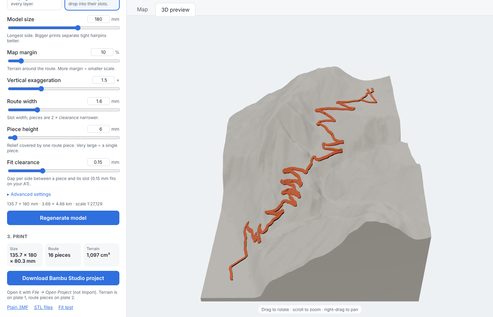

# 3D Topo Print

A web app to design 3D-printable terrain models of a place, with a GPX route — a hike, a bike climb, a race — highlighted in a second colour. It produces a ready-to-print Bambu Studio project for the Bambu Lab A1 (with AMS lite), or plain 3MF / STL files for any slicer.



- Upload a GPX file; the terrain is framed automatically around the route.
- Route cutter: print only part of a route (e.g. just the climb), chosen on its elevation profile.
- Real elevation data (Copernicus GLO-30, 30 m resolution, worldwide), downloaded and cached automatically.
- Two print modes:
  - **Blended** — terrain and route printed together in two colours with the AMS.
  - **Inlay** — terrain and route printed separately; the route pieces then drop into slots in the terrain. No purge waste.
- Live map of the print area, 3D preview, and downloads.

Progress, architecture and design decisions are tracked in [docs/PLAN.md](docs/PLAN.md).

---

## Contents

1. [Quick start](#quick-start)
2. [Using the app](#using-the-app)
3. [Print modes](#print-modes)
4. [Settings](#settings)
5. [Printing in Bambu Studio](#printing-in-bambu-studio)
6. [How it works](#how-it-works)
7. [API](#api)
8. [Development](#development)
9. [Troubleshooting](#troubleshooting)
10. [Data sources and credits](#data-sources-and-credits)

---

## Quick start

### Requirements

| Tool | Version | Install |
|---|---|---|
| Git | any | https://git-scm.com |
| Node.js | 20 or newer | https://nodejs.org |
| uv (Python manager) | recent | macOS / Linux: `curl -LsSf https://astral.sh/uv/install.sh \| sh`<br>Windows (PowerShell): `powershell -ExecutionPolicy ByPass -c "irm https://astral.sh/uv/install.ps1 \| iex"` |

uv installs a suitable Python (3.11+) and all backend libraries by itself.

### Get the code

```bash
git clone https://github.com/adrienbuche-27/3d-topo-print.git
cd 3d-topo-print
```

### Run

**macOS / Linux** — one command starts both the backend and the frontend:

```bash
./scripts/dev.sh
```

**Windows** — use two terminals:

```bash
# terminal 1: backend (http://localhost:8000)
cd backend
uv sync
uv run uvicorn app.main:app --reload --port 8000

# terminal 2: frontend (http://localhost:5173)
cd frontend
npm install
npm run dev
```

Then open **http://localhost:5173**.

The first start takes a few minutes (libraries are downloaded). The first model of a new area also downloads its elevation tile (about 40 MB per 1° × 1° square); it is cached in `backend/.cache/dem/` and reused afterwards.

---

## Using the app

1. **Route** — drop a `.gpx` file on the upload area (or click to choose one). Tracks and planned routes from Strava, Garmin, Komoot, etc. work. The app shows the name, distance, climb and highest point, and draws the route on a topographic map.
2. **Portion to print** *(optional)* — under the route stats, the elevation profile has two handles: drag them (or focus one and use the arrow keys, Shift for bigger steps) to print only part of the route. The stats, the map (selected part in orange, the rest faded) and the print area follow the selection; *Whole route* resets it.
3. **Model** — choose the print mode and adjust the settings. The dashed rectangle on the map is the area that will be printed; it follows the *Map margin* and *Model size* sliders, and the line below the settings gives the model's footprint in mm, the real area in km and the scale.
4. **Generate** — builds the model (about 5–20 s) and opens the 3D preview. Drag to rotate, scroll to zoom, right-drag to pan. In inlay mode the preview shows the pieces sitting in their slots.
5. **Print** — download the **Bambu Studio project** (recommended), or a plain 3MF, the STL files, or (inlay mode) the fit test. If you change a setting after generating, the app reminds you to regenerate.

---

## Print modes

### Blended (one print, two colours)

The route is a coloured band set into the terrain: it sinks `groove depth` (1 mm) into the terrain and stands `route raise` (0.6 mm) above it. Terrain and route share their faces exactly, so the AMS prints them together.

- ✅ One print, nothing to assemble.
- ⚠️ Every layer that contains the route needs two colour changes, so purge waste grows with the route's height range. A high-relief route (e.g. Alpe d'Huez: ~325 layers with route) can purge a lot of filament. The project turns on *flush into this object's infill* for the terrain to absorb part of it; the colour pair matters too (see [tips](#reducing-purge-in-blended-mode)).

Best for: small models, low relief, or when you want a single print.

### Inlay (two separate prints)

A route printed on its own would float in mid-air, so the route is split into **short pieces with flat bottoms** that print flat on the bed without supports:

- Walking along the route, a new piece starts each time the terrain under it has changed by `piece height` (6 mm by default). Cuts run square across the road; on hairpins each leg keeps its own piece; a road ridden twice (up and down) counts once.
- The terrain gets a slot for each piece. The slot floors step up the mountain, and each piece rests on its own step, its top following the terrain plus 0.6 mm.
- Pieces are `fit clearance` (0.15 mm) smaller than their slot on every side, leaving a 0.3 mm joint between neighbouring pieces.
- A very large piece height (e.g. 1000 mm) gives **one single piece** for the whole route — fine for flat routes, but on high relief it becomes a tall, thin strip that is fragile to print.

- ✅ No purge waste, each part in one colour.
- ⚠️ Pieces to place by hand (they come out in their map layout on the bed, so the order is obvious).

Best for: large or high-relief models.

**Fit test** — before a big inlay print, print the *Fit test* (40 × 24 mm block with an S-shaped route over two pieces, using your width, clearance and piece height). 0.15 mm clearance fits well on the A1 with PLA.

---

## Settings

| Setting | Default | What it does |
|---|---|---|
| Mode | Blended | Blended or inlay, see above. |
| Model size | 180 mm | Length of the model's **longest side** (max 250 mm on the A1 for now). A bigger print separates tight hairpins better. |
| Map margin | 10 % | Terrain shown around the route, as a % of the route's larger extent, added on every side. More margin = wider map but smaller scale. |
| Vertical exaggeration | 1.5× | Multiplies heights. 1× is true scale; 1.5–2× reads better on gentle terrain; high mountains may need less. |
| Route width | 1.2 mm (blended), 1.6 mm (inlay) | Width of the route band. In inlay mode this is the slot width; pieces are 2 × clearance narrower. Use multiples of the 0.4 mm nozzle. |
| Piece height *(inlay)* | 6 mm | Terrain relief covered by one route piece. Very large = a single piece. |
| Fit clearance *(inlay)* | 0.15 mm | Gap per side between a piece and its slot. |
| Base thickness *(advanced)* | 3 mm | Solid base under the lowest point of the terrain. |
| Route raise *(advanced)* | 0.6 mm | How far the route stands above the terrain. |
| Groove depth *(advanced)* | 1 mm | How deep the route sits into the terrain. Must be less than the base thickness. |
| Detail *(advanced)* | 0.25 mm | Spacing of the terrain grid. Finer = more detail, slower, bigger files. |

---

## Printing in Bambu Studio

### Open the project

Use **File → Open Project** (Ctrl+O), or double-click the file. Do **not** use *File → Import*: imports load the geometry only, and Bambu Studio 2.8.2 then shows *"The 3mf file has invalid config, load geometry data only"* for any 3MF, including its own projects.

The project is set up for: **Bambu Lab A1, 0.4 mm nozzle, 0.20 mm Standard**, with four AMS filaments (purple PLA, white PLA, black PLA, translucent PETG). The terrain uses **filament 1** and the route **filament 2**; change either in the *Objects* panel (right-click → *Change filament*).

- **Blended**: one plate, one object with two parts (`terrain`, `route`).
- **Inlay**: terrain on **plate 1**, route pieces on **plate 2** (laid out like the map). Print each plate with the filament of your choice.

### Print tips

- **Infill**: the terrain is a solid block; 10–15 % sparse infill is plenty and saves a lot of filament and time.
- **Layer height**: 0.2 mm is a good default. 0.12–0.16 mm smooths the slopes on tall models but takes longer.
- **Inlay assembly**: press each piece into its slot from above, starting from the lowest one. The pieces lie on the bed in their map layout, so picking the next one is easy. If a piece is tight, a light sanding of its sides is enough; if all are tight, increase the clearance by 0.05 mm.

### Reducing purge in blended mode

- Open the file as a **project**, so *flush into this object's infill* is applied.
- Pick a cheap colour pair: going from a dark to a light colour needs far more purge than the reverse (in the reference flush table, purple → white costs 525 mm³ per change, white → purple 186 mm³).
- Lower the vertical exaggeration or the model size: fewer layers contain the route.
- For high-relief routes, use inlay mode.

---

## How it works

```
GPX ─► clean, simplify, stats ─► print frame (rectangle in local UTM, + margin)
                                          │
Copernicus GLO-30 tiles ─► mosaic ─► heightfield (grid in print mm)
                                          │
                     ┌────────────────────┴────────────────────┐
                 blended                                     inlay
   terrain − (route band above the groove floor)   route band split into pieces;
   route = band ∩ raised terrain                   stepped slots; pieces shrunk by clearance
                     └────────────────────┬────────────────────┘
                                          │
              Bambu Studio project · 3MF · STL zip · GLB preview
```

| Module (`backend/app/`) | Role |
|---|---|
| `gpx.py` | Parse tracks or routes, remove duplicates and GPS spikes, Douglas-Peucker simplification, distance/climb stats, print frame (UTM rectangle with margin). |
| `dem.py` | Copernicus GLO-30 tiles: official tile list (sea tiles = 0 m), download once into the cache, mosaic over a bbox. |
| `heightfield.py` | Resample the elevations onto a regular grid in print millimetres (longest side = model size). |
| `terrain.py`, `mesh.py` | Terrain surface and watertight solids from height grids. |
| `route.py` | Route centrelines and band footprint; blended mode groove and insert (boolean operations with manifold3d). |
| `inlay.py` | Inlay mode: Voronoi split of the route band along the centreline, stepped slots, pieces; fit test. |
| `export.py` | Print layouts; plain 3MF, STL zip, GLB preview. |
| `bambu/` | Bambu Studio project writer and its preset template (`project_settings.config`). |
| `pipeline.py`, `api.py` | End-to-end build and the HTTP API. |

The frontend (`frontend/src/`) is React + TypeScript with MapLibre (map) and react-three-fiber (3D preview).

All geometry is built with exact boolean operations, so every printed body is a closed, manifold solid; the tests check this, as well as exact volumes, clearances and the 3MF structure (with lib3mf, the 3MF reference implementation).

---

## API

The backend runs on http://localhost:8000; interactive docs at http://localhost:8000/docs.

| Method | Path | Purpose |
|---|---|---|
| POST | `/api/gpx` | Upload a GPX (multipart `file`). Returns `gpx_id`, name, stats, length, elevation profile, bbox and the track as GeoJSON. |
| GET | `/api/gpx/{gpx_id}/frame?margin_pct=&size_mm=&start_km=&end_km=` | Print area and model footprint for a margin and size, and the selected portion of the route (stats + GeoJSON). |
| POST | `/api/models` | Build a model. JSON body: `gpx_id`, `mode`, optional `start_km` / `end_km` (route cutter) and the [settings](#settings) (`size_mm`, `margin_pct`, `z_exaggeration`, `route_width_mm`, `base_mm`, `route_raise_mm`, `groove_depth_mm`, `resolution_mm`, `inlay_clearance_mm`, `inlay_piece_height_mm`). Returns `model_id`, stats and URLs. |
| GET | `/api/models/{model_id}/preview.glb` | Simplified mesh for the 3D preview. |
| GET | `/api/models/{model_id}/download?format=bambu\|3mf\|stl` | Printable files. |
| GET | `/api/fit-test?format=&route_width_mm=&inlay_clearance_mm=&inlay_piece_height_mm=` | Inlay fit test. |

The app is single-user and keeps uploads and models in memory (the last 20 tracks and 5 models).

---

## Development

```
backend/    FastAPI app (Python, uv), tests in backend/tests
frontend/   React + Vite + TypeScript
docs/       PLAN.md: architecture, progress, decisions
scripts/    dev.sh: run backend and frontend together
```

### Checks

```bash
cd backend
uv run ruff check . && uv run ruff format --check .
uv run pytest                    # all tests (a few download real elevation data)
uv run pytest -m "not network"   # offline tests only

cd frontend
npm run lint && npm run format:check && npm run build
```

Tests marked `network` download real Copernicus tiles (Mont Blanc, Chamonix, Alpe d'Huez) into a temporary folder or the cache. The other tests use synthetic elevation tiles.

### Configuration

| Variable | Default | Purpose |
|---|---|---|
| `TOPO_DEM_CACHE_DIR` | `backend/.cache/dem` | Where elevation tiles are cached. |

### Bambu Studio preset template

`backend/app/bambu/project_settings.config` comes from a project saved by Bambu Studio 2.8.2.61 (A1, 0.4 mm nozzle, 0.20 mm Standard, four AMS filaments). To change the printer, process or filaments, save a project in Bambu Studio with the wanted presets and copy its `Metadata/project_settings.config` there (a `.3mf` is a zip file). Bambu Studio fills every value from its own system presets of the same names, so the template keeps working across updates.

---

## Troubleshooting

| Problem | Fix |
|---|---|
| Bambu Studio: *"The 3mf file has invalid config, load geometry data only"* | Open the file with **File → Open Project**, not *Import*. |
| Map background is empty but the route shows | The map tiles (OpenTopoMap) could not be reached; check your internet connection. The rest of the app works without them. |
| *Elevation data unavailable* | The Copernicus tile could not be downloaded. Check the connection and generate again; downloaded tiles are kept in the cache. |
| Generation is slow or files are huge | Increase *Detail* (e.g. 0.4 mm) or reduce the model size. |
| *Not a valid GPX file* | The file is not GPX (e.g. a FIT or TCX file). Export GPX from your app. |
| Inlay pieces too tight / too loose | Print the fit test and adjust *Fit clearance* by ±0.05 mm. |

---

## Data sources and credits

- **Elevation**: Copernicus DEM GLO-30 — © DLR e.V. 2010–2014 and © Airbus Defence and Space GmbH 2014–2018, provided under COPERNICUS by the European Union and ESA; all rights reserved. Hosted as open data on AWS (`s3://copernicus-dem-30m`).
- **Map**: © [OpenStreetMap](https://www.openstreetmap.org/copyright) contributors, SRTM; map style © [OpenTopoMap](https://opentopomap.org) (CC-BY-SA).
- **Libraries**: FastAPI, rasterio/GDAL, pyproj, shapely, trimesh, manifold3d, React, MapLibre GL JS, three.js / react-three-fiber.
